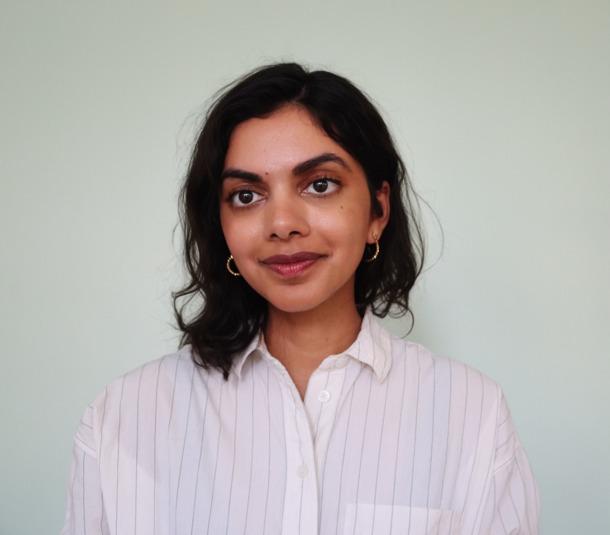

Hi! I'm Harini. I am an Assistant Professor of Computer Science at Brown University, where I am also affiliated with the Department of Science, Technology & Society (STS) and the [Center for Technological Responsibility, Reimagination, and Redesign (CNTR)](https://cntr.brown.edu/) at the Data Science Institute.  At Brown, I run the Data in Society Collective, or [DISCO Lab](https://browndiscolab.github.io/discolab/).  My work explores how to create data and sociotechnical systems that are grassroots, participatory, accountable, and equitable.  I take an interdisciplinary approach, and am strongly informed by literature in STS, feminist and critical theory, sociology, and anthropology.

Previously, I was a postdoc at Cornell, working with [Emma Pierson](https://www.cs.cornell.edu/~emmapierson/), [Jon Kleinberg](https://www.cs.cornell.edu/home/kleinber/) and [Karen Levy](https://www.karen-levy.net/).  I did my PhD in computer science at MIT, where I was lucky to be advised by [John Guttag](https://people.csail.mit.edu/guttag/), [Arvind Satyanaryan](https://arvindsatya.com/), and [Catherine D'Ignazio](https://kanarinka.com/), and was part of the [Clinical and Applied Machine Learning Group](https://ddig.csail.mit.edu/), the [Visualization Group](http://vis.csail.mit.edu/), and the [Data + Feminism Lab](https://dataplusfeminism.mit.edu/). Some examples of my past work include [co-designing context-specific datasets and models](https://dl.acm.org/doi/10.1145/3531146.3533132) to support civil society activists monitoring gender-related violence, or [building systems](https://dl.acm.org/doi/10.1145/3544548.3581482) that enable people affected by ML systems to probe and evaluate models in terms of semantically-meaningful concepts that are important to their context.  During my PhD, I spent a couple summers interning at Google Brain, where I worked on [studying biases](https://arxiv.org/pdf/2011.03395.pdf) in word embedding models and building interactive [visualizations](https://github.com/PAIR-code/book-viz) of books with sentence embeddings. I also love traveling, reading, making pottery, [cooking and baking](https://www.instagram.com/thebubblesbakery/), and doing aerial arts. (This website template is forked from [this repo](https://github.com/ankitsultana/researcher).)
